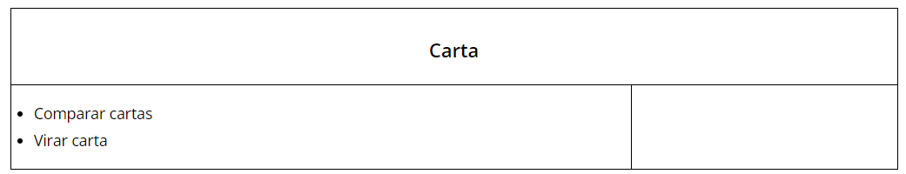
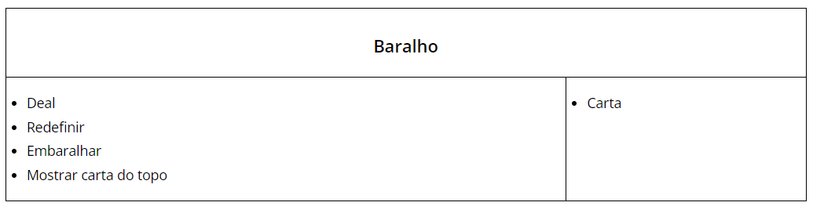
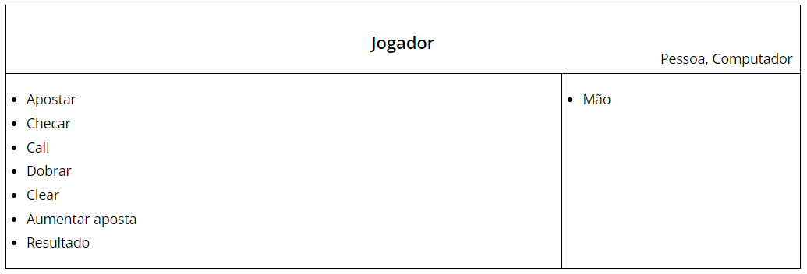
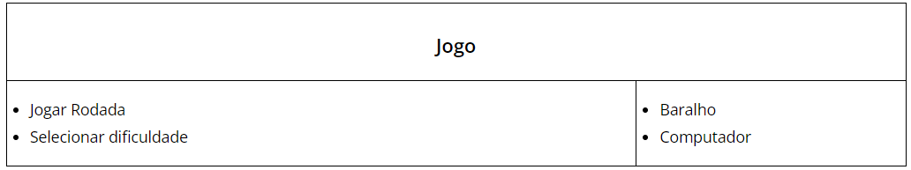

#Index 
1.[Descrição](#Descrição)

2.[Funcionalidades](#funcionalidades) 

3.[Tecnologias Utilizadas](#tecnologias)

4.[CRC Cards](#crccards)

5.[Status](#status)

<h1 id = Descrição>Descrição</h1>  

Projeto feito para colocar em prática os conhecimentos adquiridos na disciplina de Programação e Desenvolvimento de Software da UFMG. Consiste em um jogo de Texas Holdem Poker, feito para até quatro jogadores, com um bot que faz contagem de cartas para determinar a melhor jogada.  

Projeto executado por:  

Daniel Moreira dos Santos 
Pedro Henrique Esteves Dalla-Lana 
Sarah Aline Caetano Cruz 
Sanny Cristiane Moreira de Sales

   
<h1 id = funcionalidades>Funcionalidades</h1>

<h2>1- Guardar nome e valores de aposta de jogadores. </h2>
 
Para cada jogador da rodada, o sistema guarda o nome, a mão e os valores de aposta  

<h2>2- Apostar, correr, cobrir, aumentar</h2> 
Em cada rodada, cada jogador tem a opção de correr e perder o valor apostado, continuar com a aposta feita ou aumentar a aposta.  

<h2>3- Comparar cartas e sets de cartas</h2>  
As funções comparam as cartas da mão e da mesa e selecionam a melhor combinação feita com até 5 delas.  

<h1 id = Tecnologias>Tecnologias Utilizadas</h1>

<h5>C++</h4>
  

<h1 id = projeto> Projeto </h1> 

<h1 id = crccards> CRC Cards </h1> 

  Compara valores uma a uma e deixa a carta virada com o rosto para cima ou para baixo  

 Distribui as cartas aos jogadores, cria um novo baralho a cada jogo iniciado, embaralha as cartas e mostra a carta do topo  

 Compara a mão do jogador e adiciona uma carta à mão, caso necessário  

  Fazer uma aposta, comparar mão do jogador com cartas na mesa, igualar a aposta, dobrar a aposta, limpar a mesa (caso bot) mostrar resultado  

  Fazer o movimento do bot de acordo com a dificuldade escolhida   

 Inicia o jogo e define a dificuldade do bot  

<h1 id = status>Status</h1> 
Em andamento.

